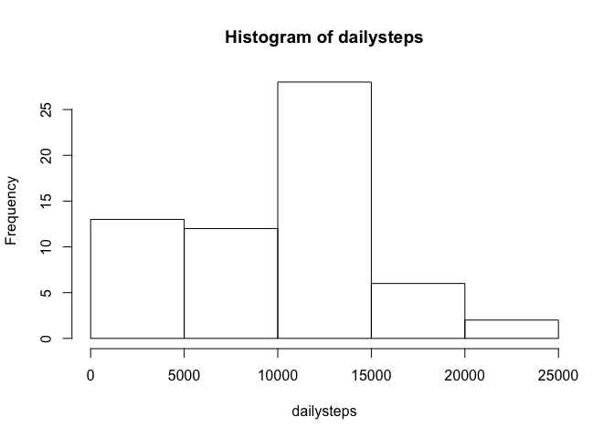
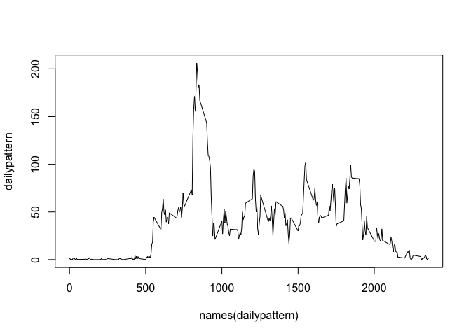
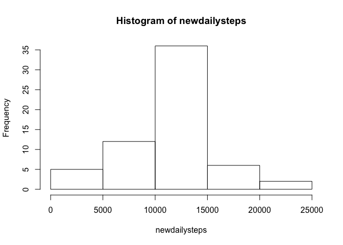
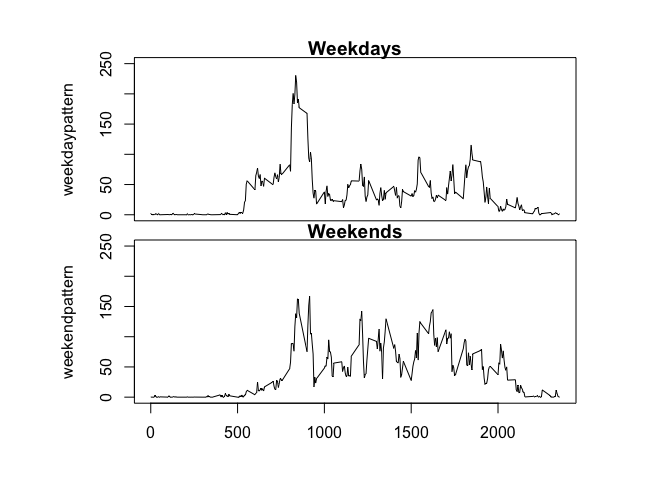

# Reproducible Research: Peer Assessment 1

## Loading and preprocessing the data
Read activity data from saved file from web page ""   

```r
## Download file from web page and save
download.file("https://d396qusza40orc.cloudfront.net/repdata%2Fdata%2Factivity.zip", "activity.zip",method="curl")
unzip("activity.zip",overwrite=TRUE)
## Read save file
activity<-read.csv("activity.csv")
```

## What is mean total number of steps taken per day?

```r
## Split dataset according date and apply sum function to each date
dailysteps<-sapply(split(activity$steps,activity$date),sum,na.rm=TRUE)
## Draw histogram figures to show the steps taken per days
hist(dailysteps)
```


*The median of the total numbers of steps taken per days is 10395.   
*The mean of the total numbers of steps taken per days is 9354.2295082.   

## What is the average daily activity pattern?

```r
## Split dataset according to time interval and apply mean function to each interval acrros days
dailypattern<-sapply(split(activity$steps,activity$interval),mean,na.rm=TRUE)
## Plot means of steps (y axis) v.s. time interval (x-axis) 
plot(names(dailypattern),dailypattern,type="l")
```


On average across all the days in the dataset, the 5-minutes interval which contains the maximum number of steps are:

```r
## List time intervals which contains the maxium number of steps 
which.max(dailypattern)
```

```
## 835 
## 104
```


## Imputing missing values
There are 2304 NAs in the datasets.   

```r
## Replace missing value by average steps in time interval across all days
newactivity<-activity
for (i in 1:dim(newactivity)[1]){
  if (is.na(newactivity$steps[i])) {
    newactivity$steps[i]<-dailypattern[as.character(newactivity$interval[i])]
  }
}
## Recalculate the distribution of steps across days
newdailysteps<-sapply(split(newactivity$steps,newactivity$date),sum,na.rm=TRUE)
hist(newdailysteps)
```


The missing value in the dataset will be replaced by the average steps in the 5 minutes interval across alldays.   
After this replacement,The median of the total numbers of steps taken per days is 1.0766189\times 10^{4}.   
The mean of the total numbers of steps taken per days is 1.0766189\times 10^{4}.   

## Are there differences in activity patterns between weekdays and weekends?


```r
## Use timeDate package to set tags of "weekday" and "weekend" for each observation and split dataset according to weekday or weekend, then alpply mean function
library(timeDate)
newactivity$weekdays<-c("weekday")
newactivity$weekdays[isWeekend(newactivity$date)]<-c("weekend")
weekdaypattern<-sapply(split(newactivity$steps[newactivity$weekdays=="weekday"],newactivity$interval[newactivity$weekdays=="weekday"]),mean,na.rm=TRUE)
weekendpattern<-sapply(split(newactivity$steps[newactivity$weekdays=="weekend"],newactivity$interval[newactivity$weekdays=="weekend"]),mean,na.rm=TRUE)
## Use mfrow to set the darwing layout and mar to set margin
oldpar<-par(mar=c(0,4,1,4),oma=c(4,3,2,1),mfrow=c(2,1))
plot(names(weekdaypattern),weekdaypattern,main="Weekdays",type="l",xaxt="n",ylim=c(0,250))
plot(names(weekendpattern),weekendpattern,main="Weekends",type="l",ylim=c(0,250),xlab="Time interval")
```



```r
par(oldpar)
```
It seems that the number of steps in weekdays from time interval 500 to 1000 are larger than that of weekends. The number of steps in weekdays from time interval 1000 to 2000 are smaller than that of weekends.
